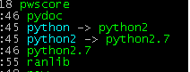
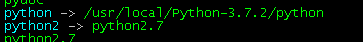

## 在Linux系统中安装Python 3.7

安装Linux后,往往自带了Python，但因为版本比较低，时常不能满足自己的需求。我们需要安装最新的版本。
下面是我在CentOS 7  中安装Python3.7的笔记与步骤。
安装方式为源码安装。

### 准备事项
##### 1. 下载源码包：
    https://www.python.org/downloads/release/python-372/
访问官网，下载source tarball源码包。
将源码包，上传到你的Linux服务器中。

##### 2.服务器安装依赖包
安装 python 3.7 需要的依赖包，否则会在安装过程中报错。
```shell

yum -y groupinstall

yum -y install zlib-devel

#下面这个libffi-devel包是在3.7中新增的依赖包
yum -y install libffi-devel
```

### 开始安装
切换到源码包.tgz存放路径，我存放的位置是/usr/local/
按照一下步骤执行
```shell
#1.源码包解压缩
tar -zxvf Python-3.7.2.tgz
#2.进入程序目录执行安装
#(1)配置安装目录
./configure --prefix=/usr/local/Python-3.7.2
#(2）编译源码
make
#(3)执行安装
make install
```
以上就是安装成功啦。
检验安装成果，我们执行我们安装目录下的python可执行文件
```shell
./python #这里不直接输入python的原因是我们还没有配置环境变量，直接执行python会进入到系统之前的python版本
```
输出如下，可以看到我们已安装成功了：

    Python 3.7.2 (default, Jan 21 2019, 01:16:05)
    [GCC 4.8.5 20150623 (Red Hat 4.8.5-36)] on linux
    Type "help", "copyright", "credits" or "license" for more information.
    >>>

下面我们试试直接执行python
```linux
[root@hadoop Python-3.7.2]#python
```
从输出可以看到，我们仍旧进入的是以前的版本。

    [root@hadoop Python-3.7.2]# python
    Python 2.7.5 (default, Oct 30 2018, 23:45:53)
    [GCC 4.8.5 20150623 (Red Hat 4.8.5-36)] on linux2
    Type "help", "copyright", "credits" or "license" for more information.
    >>>

那么我们不能每次想要运行我们安装的这个版本python时，都进入这个目录吧？
下面我们配置环境变量

### 配置环境变量
因为我们已有一个低版本python，对应的启动命令就是：python
为了区分旧版本和最新的python版本。
我们先将旧版本启动命令改为python2
```shell
#1.找到python命令所在路径,使用which命令
[root@hadoop Python-3.7.2]# which python
/usr/bin/python
#2.将这个启动命令重命名为python2
[root@hadoop Python-3.7.2]#cd /usr/bin/python
[root@hadoop bin]# mv python python2
mv：是否覆盖"python2"？
#原来我们已经自带了python2了，我们使用ctrl+c 退出，或者回复N，否。
#3.我们删除掉现有python(它是一个软连接)，创建我们python3.7对应的连接
[root@hadoop bin]# rm python
rm：是否删除符号链接 "python"？y
#创建我们3.7版本对应的一个软连接
[root@hadoop bin]# ln -s /usr/local/Python-3.7.2/python python
#可以看到 现在/usr/bin下有3个python启动命令了，这些都可以启动我们的python。当然对应不同版本
[root@hadoop bin]# ll |grep 'python'
lrwxrwxrwx    1 root root        30 1月  21 02:00 python -> /usr/local/Python-3.7.2/python
lrwxrwxrwx    1 root root         9 1月  19 22:45 python2 -> python2.7
-rwxr-xr-x    1 root root      7216 10月 31 07:46 python2.7
#下面我们再试一下python直接启动的效果
[root@hadoop bin]# python
Python 3.7.2 (default, Jan 21 2019, 01:16:05)
[GCC 4.8.5 20150623 (Red Hat 4.8.5-36)] on linux
Type "help", "copyright", "credits" or "license" for more information.
>>>
```
其实在我们修改前的python，也是一个软连接，指向了python2.7



我们将python 指向 3.7版本后



### 我碰到的报错：
#### 1. ModuleNotFoundError: No module named '_ctypes'
未安装 libffi-devel
```shell
yum install -y libffi-devel
```
